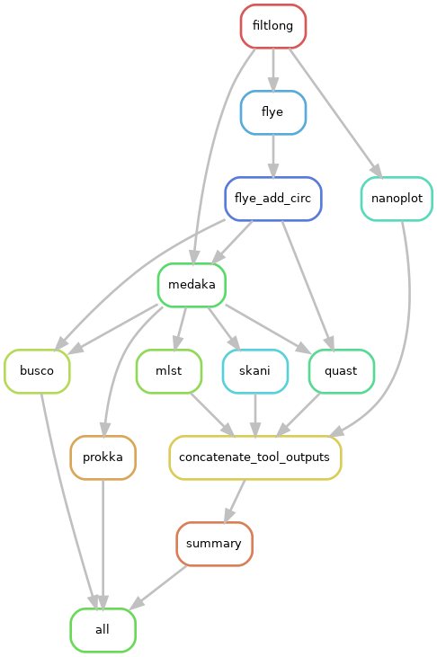

# nanoQC
A quality control workflow implemented in Snakemake to assemble Nanopore (long read) data.

## Summary

As part of the [Data Flow SOP](https://github.com/Snitkin-Lab-Umich/Data-Flow-SOP) in the [Snitkin lab](https://thesnitkinlab.com/index.php), this pipeline should be run on raw sequencing data as soon as it is available from [Plasmidsaurus](https://www.plasmidsaurus.com/).

In short, it performs the following steps:

- Runs [Filtlong](https://github.com/rrwick/Filtlong) (v0.2.1) to remove low quality reads and discards reads less than 1000 Bp.
- Generates pre and post-Filtlong QC plots using [Nanoplot](https://github.com/wdecoster/NanoPlot) (v1.42.0).
- Assemble clean filtlong nanopore reads with [Flye](https://github.com/fenderglass/Flye) (v2.9.5) assembler.
- Flye assembly is then polished with long reads using [Medaka](https://github.com/nanoporetech/medaka) (v1.2.0)
- The medaka assembly is then passed through [Prokka](https://github.com/tseemann/prokka) (v1.14.6) for annotation, [skani](https://github.com/bluenote-1577/skani) (v0.2.2) to identify closest reference genome, and [MLST](https://github.com/tseemann/mlst) (v2.23.0) for determining sequence type based on sequences of housekeeping genes
- Flye and medaka assemblies are then run on [BUSCO](https://busco.ezlab.org/) (v5.8.2) for assembly completeness statistics and [QUAST](https://quast.sourceforge.net/) (v5.3.0) for assembly statistics.

The workflow generates all the output in the `prefix` folder set in  `config/config.yaml`. Each workflow steps gets its own individual folder as shown below. This structure provides a general view of how outputs are organized, with each tool or workflow step having its own directory. **Note that this overview does not capture all possible outputs from each tool; it only highlights the primary directories and _SOME_ of their contents.** 

```
results/2025-04-29_Project_IMPALA_nanoQC/
├── 2025-04-29_Project_IMPALA_nanoQC_report
|   ├── 2025-04-29_Project_IMPALA_nanoQC_mlst_results.csv
|   ├── 2025-04-29_Project_IMPALA_nanoQC_nanoplot_results.csv
|   ├── 2025-04-29_Project_IMPALA_nanoQC_quast_results.csv
|   ├── 2025-04-29_Project_IMPALA_nanoQC_report.csv
|   └── 2025-04-29_Project_IMPALA_nanoQC_Skani_report_final.csv
├── busco
|   ├── IMPALA_nano_1
|   └── IMPALA_nano_2
├── filtlong
|   ├── IMPALA_nano_1
|   └── IMPALA_nano_2
├── flye
|   ├── IMPALA_nano_1
|   └── IMPALA_nano_2
├── medaka
|   ├── IMPALA_nano_1
|   └── IMPALA_nano_2
├── mlst
|   ├── IMPALA_nano_1
|   └── IMPALA_nano_2
├── nanoplot
|   ├── IMPALA_nano_1
|   └── IMPALA_nano_2
├── prokka
|   ├── IMPALA_nano_1
|   └── IMPALA_nano_2
├── quast
|   ├── IMPALA_nano_1
|   └── IMPALA_nano_2
└── skani
    ├── IMPALA_nano_1
    └── IMPALA_nano_2
```


## Installation

> If you are using Great Lakes HPC, ensure you are cloning the repository in your scratch directory. Change `your_uniqname` to your uniqname. 

```

cd /scratch/esnitkin_root/esnitkin1/your_uniqname/

```

> Clone the github directory onto your system.

```

git clone https://github.com/Snitkin-Lab-Umich/nanoQC.git

```

> Ensure you have successfully cloned `nanoQC`. Type `ls` and you should see the newly created directory **nanoQC**. Move to the newly created directory.

```

cd nanoQC

```

> Load bioinformatics, snakemake and singularity modules from Great Lakes modules.

```

module load Bioinformatics snakemake singularity

```


This workflow makes use of singularity containers available through [State Public Health Bioinformatics group](https://github.com/StaPH-B/docker-builds). If you are working on [Great Lakes](https://its.umich.edu/advanced-research-computing/high-performance-computing/great-lakes) (UofM HPC)—you can load snakemake and singularity modules as shown above. However, if you are running it on your local machine or other computing platform, ensure you have snakemake and singularity installed.

## Setup config and sample files

**_If you are just testing this pipeline, the config and sample files are already loaded with test data, so you do not need to make any additional changes to them. However, it is a good idea to change the prefix (name of your output folder) in the config file to give you an idea of what variables need to be modified when running your own samples on nanoQC._**


### Customize config.yaml and set tool specific parameters
As an input, the snakemake file takes a config file where you can set the path to `samples.csv`, path to Nanopore long reads, path to adapter file etc. Instructions on how to modify `config/config.yaml` is found in the file itself.

### Samples

`config/samples.csv` should be a comma seperated file consisting of one column—barcode_id.

You can create `samples.csv` file using the following for loop.

> You can create `config/samples.csv` file using the following for loop. Instead of `/path/to/your/data/`, give the path to your long reads.  `fastq-File-Pattern*` would be if your samples looked like this: `IMPALA_nano_10, IMPALA_nano_17, IMPALA_nano_23`, the wildcard pattern that would catch all the samples would `IMPALA_nano*`. 

```
echo "barcode_id" > config/samples.csv

for longread in /path/to/your/data/fastq_File_Pattern*; do
    barcode_id=$(basename $longread | sed 's/.fastq.gz//g')
    echo $barcode_id
done >> config/samples.csv

```

> Check if `samples.csv` is populated with your samples. Hit `q` to exit.

```
less config/samples.csv
```

## Quick start

### Run nanoQC on a set of samples.


>Preview the steps in nanoQC by performing a dryrun of the pipeline.

```

snakemake -s workflow/nanoQC.smk --dryrun -p

```

> Run the pipeline locally. 

```

snakemake -s workflow/nanoQC.smk -p --configfile config/config.yaml --cores all

```

> Run the pipeline on Great Lakes HPC (the terminal directly—your terminal window will be busy and cannot be used. You would have to open to a new tab to work on the terminal). 

```

snakemake -s workflow/nanoQC.smk -p --use-singularity --use-envmodules -j 999 --cluster "sbatch -A {cluster.account} -p {cluster.partition} -N {cluster.nodes}  -t {cluster.walltime} -c {cluster.procs} --mem-per-cpu {cluster.pmem} --output=slurm_out/slurm-%j.out" --cluster-config config/cluster.json --configfile config/config.yaml --latency-wait 1000 --nolock 

```

> Submit nanoQC as a batch job on Great Lakes. 

Change these `SBATCH` commands: `--job-name` to a more descriptive name like run_nanoQC, `--mail-user` to your email address, `--time` depending on the number of samples you have (should be more than what you specified in `cluster.json`). Feel free to make changes to the other flags if you are comfortable doing so. Once you have made the necessary changes, save the below script as `run_nanoQC.sbat`. Don't forget to submit nanoQC to Slurm! `sbatch run_nanoQC.sbat`.

```
#!/bin/bash

#SBATCH --job-name=nanoQC
#SBATCH --mail-type=BEGIN,END,FAIL
#SBATCH --mail-user=youremail@umich.edu
#SBATCH --cpus-per-task=1
#SBATCH --nodes=1
#SBATCH --ntasks-per-node=1
#SBATCH --mem-per-cpu=10gb
#SBATCH --time=08:15:00
#SBATCH --account=esnitkin1
#SBATCH --partition=standard

# Load necessary modules
module load Bioinformatics snakemake singularity

# Run Snakemake
snakemake -s workflow/nanoQC.smk -p --use-singularity --use-envmodules -j 999 --cluster "sbatch -A {cluster.account} -p {cluster.partition} -N {cluster.nodes}  -t {cluster.walltime} -c {cluster.procs} --mem-per-cpu {cluster.pmem} --output=slurm_out/slurm-%j.out" --cluster-config config/cluster.json --configfile config/config.yaml --latency-wait 1000 --nolock 

```



# Conclusion
At the end of the pipeline, a QC report will be generated which can be found in the report folder in this path `results/your_chosen_prefix/your_chosen_prefix_report/your_chosen_prefix_report.csv`

To find out more about how the report was created and the metrics we use to pass/fail samples, check the [wiki](https://github.com/Snitkin-Lab-Umich/nanoQC/wiki).

## Dependencies

### Near Essential
* [Snakemake>=7.32.4](https://snakemake.readthedocs.io/en/stable/#)

### Tool stack used in workflow

* [Filtlong](https://github.com/rrwick/Filtlong)
* [Nanoplot](https://github.com/wdecoster/NanoPlot)
* [Flye](https://github.com/fenderglass/Flye)
* [Medaka](https://github.com/nanoporetech/medaka)
* [Prokka](https://github.com/tseemann/prokka)
* [skani](https://github.com/bluenote-1577/skani)
* [mlst](https://github.com/tseemann/mlst)
* [BUSCO](https://busco.ezlab.org/)
* [QUAST](https://quast.sourceforge.net/)
* [Pandas](https://pandas.pydata.org/)
* [Numpy](https://numpy.org/)

